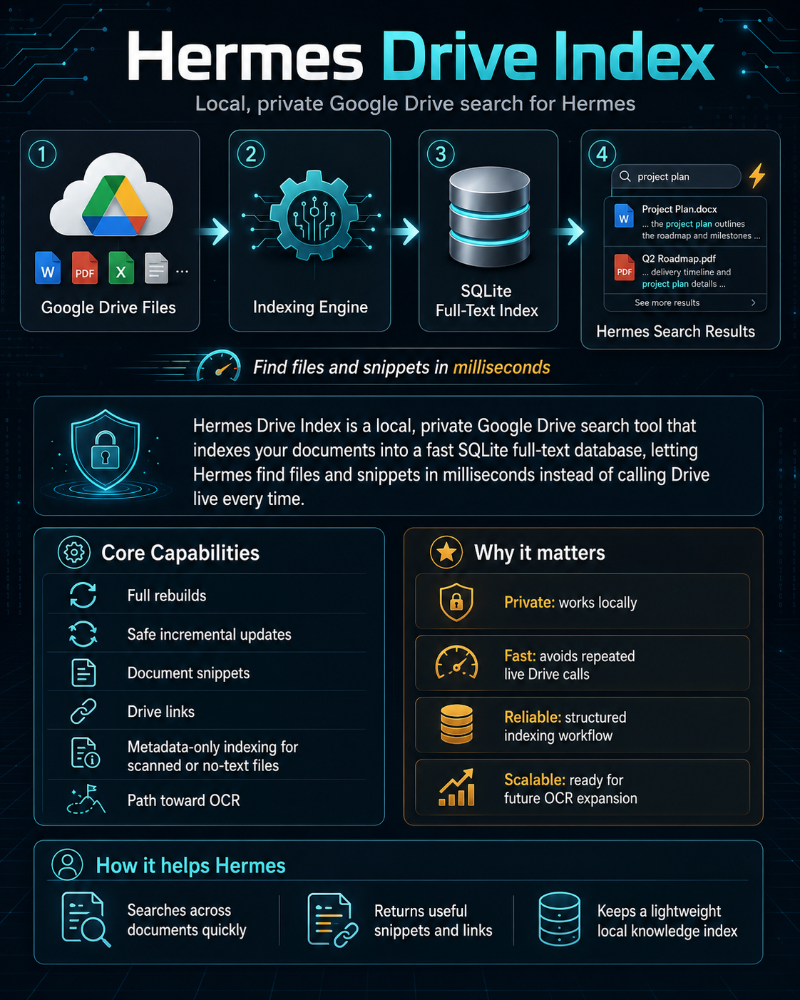

# Hermes Drive Index — Private Google Drive Search for Hermes Agent

[](https://www.python.org/) [](https://www.sqlite.org/fts5.html) [](https://github.com/NousResearch/hermes-agent)

**Hermes Drive Index** is a local, private **Google Drive search engine for Hermes Agent**. It indexes Google Drive documents into a fast **SQLite full-text search (FTS5)** database so Hermes can find files, snippets, and Drive links in milliseconds instead of calling the Google Drive API for every lookup.



## Why Hermes Drive Index?

Hermes agents often need to answer questions like:

- “Find my lease agreement in Google Drive.”
- “Which PDF has the fishing license supporting documents?”
- “Search Drive for project plan snippets.”
- “Give me the Drive link for that receipt/document.”

Live Google Drive search is useful, but it can be slow, rate-limited, and expensive to call repeatedly. Hermes Drive Index keeps a lightweight local search index so an AI agent can retrieve relevant personal or team documents quickly while keeping document text on your machine.

## Key features

- **Local Google Drive document search** — search indexed Drive files without repeated live Drive calls.
- **SQLite FTS5 full-text index** — fast local search over document chunks and metadata.
- **Hermes Agent plugin** — exposes `drive_index_search`, `drive_index_status`, and `drive_index_update` as Hermes tools.
- **Command-line interface** — use `hermes-drive-index search`, `status`, `update`, and `doctor` outside Hermes.
- **Safe incremental updates** — manifest-diff updates skip unchanged files and avoid unnecessary downloads.
- **Document snippets and Drive links** — returns ranked snippets, file names, paths, and web links.
- **Metadata-only indexing** — records scanned/no-text files by filename/path until OCR is added.
- **Privacy-first defaults** — local DBs, tokens, manifests, and private folder IDs are excluded from the repo.
- **Future OCR path** — designed to add optional OCR for scanned PDFs without changing the public API.

## How it works

```text
Google Drive folder
   ↓ crawl metadata and export/download supported docs
Indexing engine
   ↓ extract text, chunk documents, preserve metadata
SQLite FTS5 database
   ↓ local full-text search
Hermes Agent tool results
   → snippets, Drive links, file paths, metadata
```

The package separates Drive crawling, text extraction, SQLite indexing, search, CLI commands, and the Hermes adapter into normal Python modules. The Hermes plugin stays thin and stateless: it registers tools and delegates behavior to the package API.

## Install

> Current status: this repository is undergoing real-world validation in a local (Gregory local environment) setup. It is designed for local/private use first; review privacy notes before any public release.

From this repository:

```bash
python -m pip install -e '.[test]'
hermes-drive-index doctor
```

For a `pipx`-installed Hermes Agent environment:

```bash
pipx inject --editable hermes-agent /path/to/hermes-drive-index
```

Enable the plugin in `~/.hermes/config.yaml`:

```yaml
plugins:
  enabled:
    - drive_index
```

Start a fresh Hermes session or restart the gateway after installing/enabling the plugin. Hermes caches tool schemas per session.

## Configure

Hermes Drive Index reads configuration from explicit API arguments, environment variables, and a local TOML config file. Keep real folder IDs and local paths outside the repository.

Example config:

```toml
# ~/.hermes/drive_index/config.toml
root_folder_name = "Personal Files"
root_folder_id = "YOUR_GOOGLE_DRIVE_FOLDER_ID"
base_dir = "/home/you/.hermes/drive_index/personal_files"
db_path = "/home/you/.hermes/drive_index/personal_files/index.db"
```

A sanitized template is available at [`examples/config.example.toml`](examples/config.example.toml).

## CLI usage

Check package and plugin health:

```bash
hermes-drive-index doctor
```

Build or update the local Google Drive index:

```bash
hermes-drive-index build --mode weekly_full
hermes-drive-index update --mode incremental_manifest
```

Search indexed Drive documents:

```bash
hermes-drive-index search "project plan" --top 5 --json
```

Inspect index status:

```bash
hermes-drive-index status
```

## Hermes Agent tools

When the plugin is installed and enabled, Hermes can use the `drive_index` toolset:

| Tool | Purpose |
| --- | --- |
| `drive_index_search` | Search the local Google Drive index for files, snippets, paths, and Drive links. |
| `drive_index_status` | Inspect DB existence, counts, size, and last run metrics. |
| `drive_index_update` | Run a rebuild or incremental update from Hermes. |

Suggested Hermes use cases:

- personal document retrieval
- Google Drive knowledge base search
- receipt, lease, license, and PDF lookup
- local RAG-style document search
- AI assistant memory augmentation for private files

## Privacy and security

This project is built for private/local search. Do **not** commit:

- OAuth tokens or Google credentials
- client secret JSON files
- real Google Drive folder IDs
- SQLite index databases (`*.db`, `*.sqlite*`)
- crawl manifests or raw Drive exports
- private golden queries, eval reports, or phase logs
- document snippets from private files

See [`docs/security.md`](docs/security.md) for the full privacy boundary.

## Architecture

Core modules live under `src/hermes_drive_index/`:

- `core/crawler.py` — Drive metadata crawling and download/export helpers
- `core/extract.py` — document text extraction and chunking
- `core/index.py` — SQLite schema and indexing operations
- `core/manifest.py` — incremental update planning
- `core/search.py` — SQLite FTS search and status
- `core/orchestrator.py` — build/update orchestration
- `hermes_adapter/` — Hermes plugin registration and JSON tool wrappers
- `cli.py` — command-line interface

See [`docs/architecture.md`](docs/architecture.md) for design details.

## Testing

Run the unit tests:

```bash
python -m pytest -q
```

The test suite includes public-data guard checks to reduce the risk of committing private Drive IDs, local DB paths, tokens, or local-only values.

## Roadmap

- Fake Drive client and synthetic fixtures for network-free CI
- Optional OCR for scanned PDFs and image-only documents
- Expanded evaluation metrics: Recall@1, Recall@5, MRR, latency, rebuild time
- Public release hardening and docs cleanup
- More configurable extraction backends

## SEO keywords

Hermes Drive Index, Hermes Agent Google Drive search, private Google Drive search, local Google Drive index, SQLite FTS Google Drive, AI agent document search, Google Drive RAG, local document retrieval, personal knowledge base search, Google Drive full-text search, Hermes plugin.

## License

Apache-2.0
